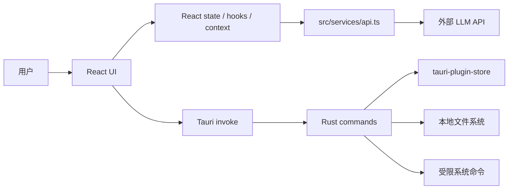

# 整体架构

## 分层视图

## 前端职责

前端是主要业务编排层，负责:

- 呈现聊天界面、侧边栏、设置页和任务确认弹窗。
- 管理当前对话、消息、任务执行状态和错误提示。
- 读取配置并调用外部 LLM API。
- 将 LLM tool call 转换为内部 `TaskRequest`。
- 在执行本地任务前展示确认弹窗。
- 调用 Tauri 命令执行任务或持久化数据。

## Tauri/Rust 后端职责

Rust 后端是本地能力边界，负责:

- 保存和读取 API 配置。
- 保存、读取、删除对话历史。
- 执行受限任务:
  - `FileRead`
  - `FileWrite`
  - `ExecuteCommand`
- 校验文件路径是否位于允许目录。
- 校验命令是否在白名单内，且参数不包含危险执行开关。

## 外部 LLM API 边界

`src/services/api.ts` 的 `sendChatMessage()` 直接使用浏览器 `fetch` 调用外部服务:

- OpenAI-compatible 默认路径: `${baseUrl}/chat/completions`
- 如果 Base URL 包含 `anthropic`: `${baseUrl}/v1/messages`
- 请求头:
  - `Content-Type: application/json`
  - API Key 非空时添加 `Authorization: Bearer <api_key>`
- 当前请求固定 `stream: false`，即非流式响应。

## 数据持久化

`tauri-plugin-store` 当前保存两类 JSON store:

| Store | Key | 内容 |
| --- | --- | --- |
| `config.json` | `base_url`、`api_key`、`model` | API 配置 |
| `conversations.json` | `conversations` | 所有对话数组 |

前端 Date 对象在保存前转为 ISO 字符串；加载后再转回 `Date`。

## 安全边界

本地任务执行受到两层约束:

- 前端确认: tool calls 先进入 `TaskConfirmation`，用户确认后才执行。
- Rust 校验:
  - 绝对路径只能位于用户 Home 下的 `Documents`、`Desktop`、`Downloads`。
  - 相对路径当前被允许。
  - 命令白名单为 `echo`、`ls`、`cat`、`pwd`、`git`、`node`、`npm`、`cargo`、`python`、`python3`。
  - 参数中禁止 `-e`、`-c`、`--eval`、`-exec`、`--execute` 以及 `-e=`、`-c=` 前缀。

