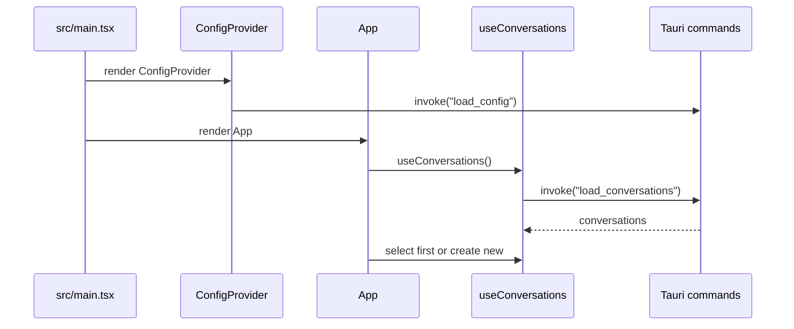
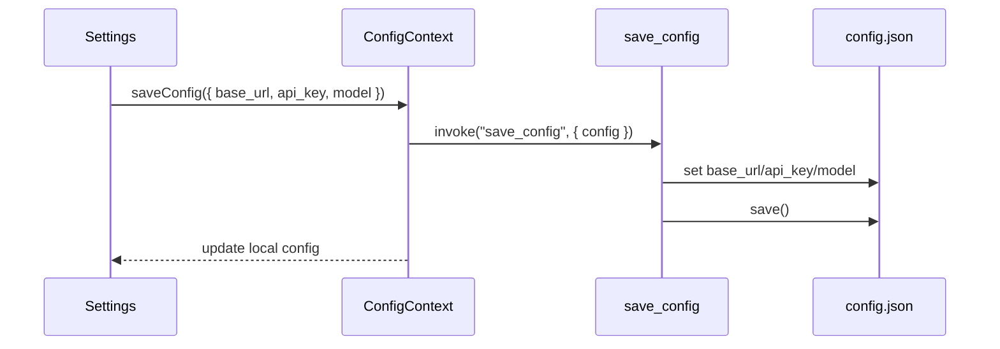
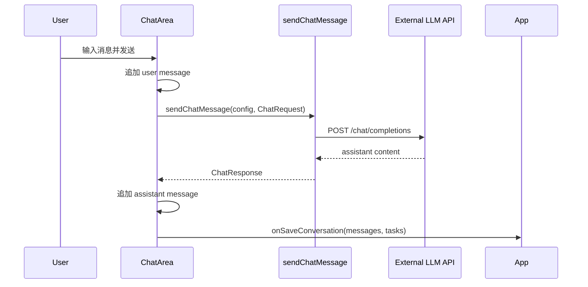
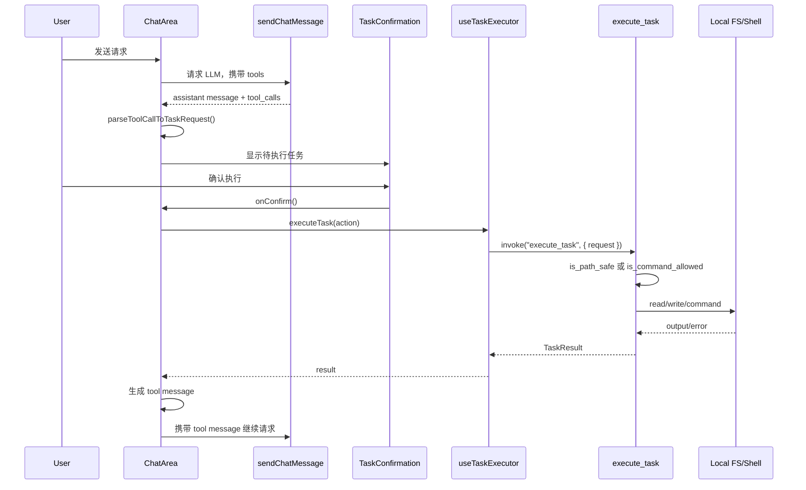
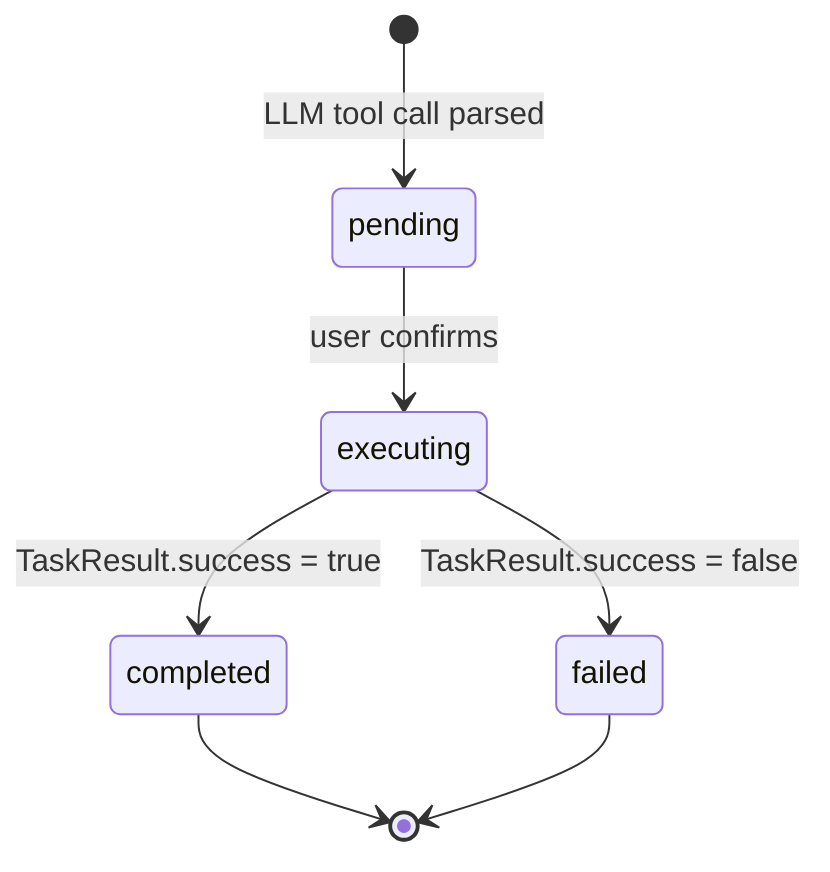

# 数据流与关键流程

## 应用启动流程



## 配置保存流程



## 普通聊天流程



## 工具调用与本地任务执行流程



## 对话保存流程

`ChatArea` 不直接调用 Tauri 保存。它通过 `onSaveConversation(messages, tasks)` 将最新状态交给 `App`:

1. `ChatArea` 内部消息或任务变化后调用 `onSaveConversation`。
2. `App` 将其暂存在 `pendingMessages` / `pendingTasks`。
3. 用户切换视图、新建对话、切换对话或窗口卸载时，`App.savePendingChanges()` 调用 `useConversations.saveConversation()`。
4. `saveConversation()`:
   - 用第一条消息生成标题。
   - 更新 `updated_at`。
   - 将 Date 转为 ISO 字符串。
   - 调用 Tauri `save_conversation`。
   - 更新本地对话列表并按更新时间排序。

## Store 数据形状

### `config.json`

```json
{
  "base_url": "https://api.example.com",
  "api_key": "sk-...",
  "model": "deepseek-v4-pro"
}
```

### `conversations.json`

```json
{
  "conversations": [
    {
      "id": "uuid",
      "title": "新对话",
      "messages": [],
      "tasks": [],
      "created_at": "2026-07-01T00:00:00.000Z",
      "updated_at": "2026-07-01T00:00:00.000Z"
    }
  ]
}
```

## 任务状态流转



当前 `ChatArea` 创建任务时直接进入 `EXECUTING`，确认弹窗中的 pending 状态主要存在于前端局部 `pendingToolCalls`。

